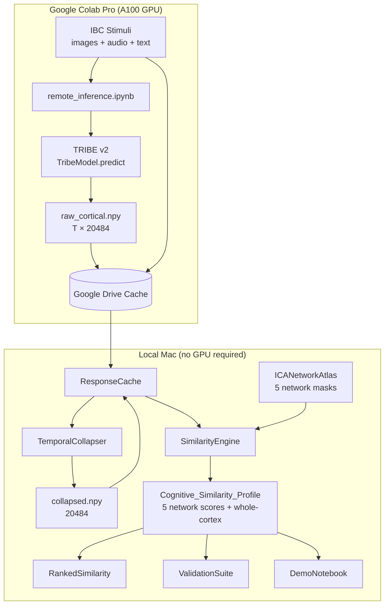

# Design Document: Cognitive Similarity

## Overview

The Cognitive Similarity system measures how similarly two stimuli would be processed by the human brain, using TRIBE v2 (Meta FAIR's tri-modal brain encoding foundation model) as the neural substrate. Rather than comparing stimuli by semantic embedding cosine similarity, this system grounds similarity in predicted whole-brain fMRI cortical activation patterns.

The pipeline is:

1. **Predict** — run each stimulus independently through TRIBE v2 to obtain a `Cortical_Response` tensor of shape `[T, 20,484]`
2. **Collapse** — reduce the timeseries to a single spatial vector `[20,484]` (the `Collapsed_Response`) via peak extraction or GLM+HRF
3. **Mask** — restrict the `Collapsed_Response` to vertices belonging to each of the five ICA networks
4. **Score** — compute Pearson correlation between two `Collapsed_Responses` per network, producing a `Cognitive_Similarity_Profile`

The system is designed to be used as a Python library. The primary entry point is `CognitiveSimilarity`, which wraps model loading, caching, and all similarity operations.

### Key Design Decisions

- **Cortical-only, single model**: `TribeModel.from_pretrained("facebook/tribev2")` returns a model hard-wired to TribeSurfaceProjector on fsaverage5, producing `(n_timesteps, 20,484)`. The paper and the library's training grid (`tribev2/grids/run_subcortical.py`) describe a subcortical variant that would produce `(n_timesteps, 8,802)` via `MaskProjector(mask="subcortical")`, but Meta has not released those weights — the HF repo ships only `best.ckpt` + `config.yaml`. This system therefore runs one predict() call per stimulus and caches only the cortical tensor.
- **Stimulus isolation via separate predict() calls**: Each stimulus is run through TRIBE v2 via its own independent `get_events_dataframe()` + `predict()` call. The TRIBE v2 API already enforces single-stimulus input (`get_events_dataframe()` accepts exactly one path). No manual silence padding is needed — `predict()` automatically discards empty segments (`remove_empty_segments=True` by default), so blank padding would be filtered out anyway. Isolation is achieved simply by never combining stimuli into a single call.
- **Pairwise Pearson correlation**: Each stimulus is run through TRIBE v2 independently and its predicted activation pattern is collapsed to a `[20,484]` vector. Similarity between two stimuli is computed as Pearson correlation between their collapsed responses, restricted to the vertices of a given ICA network. This directly mirrors the spatial Pearson correlation used by the TRIBE v2 paper (sections 2.5, 2.6, 5.10) for comparing predicted maps against ground-truth maps — we apply the same metric to compare two predicted maps against each other.
- **ICA network masks computed from model weights**: The five ICA network masks are derived by running FastICA on TRIBE v2's "unseen subject" projection layer. In the paper's notation (§5.3) the subject block is a tensor of shape `(S, D_bottleneck, N_targets)`. In the public `best.ckpt` this is stored as `model.predictor.weights` of shape `(1, 2048, 20,484)` — the leading singleton is the subject axis (S=1 in unseen-subject export), the 2,048 is the `low_rank_head` bottleneck (confirmed in `config.yaml`: `low_rank_head: 2048`), and 20,484 is the fsaverage5 vertex count. `ICANetworkAtlas` squeezes the leading axis to recover the `(2048, 20,484)` matrix, runs `sklearn.decomposition.FastICA(n_components=5)`, and thresholds each component at the top 10% of absolute values to produce binary vertex masks (~2,048 vertices each). This is a one-time computation cached locally at `<cache_dir>/ica_masks.npz`.
- **Content-addressed caching**: Both the `Collapsed_Response` and the raw `Brain_Response` timeseries are serialized to disk keyed by a SHA-256 hash of the stimulus input bytes, avoiding redundant TRIBE v2 inference.
- **10-second static videos for image stimuli**: TRIBE v2's `get_events_dataframe(video_path=...)` rejects `.jpg/.png/...`; the library's undocumented `CreateVideosFromImages` helper describes the canonical conversion (moviepy, `fps=10`, `libx264`, no audio). The paper (§5.9) ran images at 1 s per presentation inside a continuous randomized stream with a GLM fit. For single-stimulus inference we instead generate **10-second** static MP4s per image so TRIBE produces T≈10 timepoints at its 1 Hz output rate. This lets `TemporalCollapser` index `cortical_response[5]` — the hemodynamic peak per §5.8 — rather than falling back to the T=1 earliest timepoint (which empirically yielded correct orderings but Δs compressed by an order of magnitude).

---

## Architecture



### Deployment Split

The system is split across two environments:

| Environment | Components | Why |
|---|---|---|
| Google Colab Pro (A100 GPU) | `remote_inference.ipynb`, `StimulusRunner` | TRIBE v2 requires a GPU. Colab Pro (available via student plan) provides an A100, reducing inference time to ~5 minutes for the full IBC corpus. Colab's job is purely inference — run TRIBE v2, save raw tensors. |
| Local Mac | `TemporalCollapser`, `ResponseCache`, `SimilarityEngine`, `ICANetworkAtlas`, `CognitiveSimilarity`, `ValidationSuite`, `DemoNotebook` | All analysis logic runs locally. Collapsing is done locally so the strategy can be changed without re-running Colab. |

The boundary between the two is the Google Drive cache directory. Once raw tensors are cached, all similarity computation runs entirely locally with no GPU needed.

### Component Responsibilities

| Component | Environment | Responsibility |
|---|---|---|
| `remote_inference.ipynb` | Colab | Clones repo, downloads IBC stimuli, runs TRIBE v2 inference, saves raw tensors to Google Drive with resume-from-checkpoint |
| `StimulusRunner` | Colab | Calls TRIBE v2 API per stimulus, returns raw `Brain_Response` (cortical only; subcortical checkpoint not publicly released) |
| `TemporalCollapser` | Local | Reduces cortical `[T, 20,484]` → `[20,484]` via peak (≤10s) or GLM+HRF (>10s); result cached locally alongside raw tensors |
| `ResponseCache` | Both | Colab writes raw tensors; local reads raw tensors and writes/reads collapsed responses |
| `ICANetworkAtlas` | Local | Loads and exposes the five ICA network vertex masks (~2,048 vertices each) from HuggingFace |
| `SimilarityEngine` | Local | Computes per-network Pearson correlation, whole-cortex score, ranked lists |
| `CognitiveSimilarity` | Local | Top-level facade: orchestrates all components, exposes public API |
| `ValidationSuite` | Local | Runs 9 expected-ordering checks against cached IBC tensors |
| `DemoNotebook` | Local | Interactive Jupyter notebook for exploring the system |

---

## Components and Interfaces

### `CognitiveSimilarity` (public facade)

```python
class CognitiveSimilarity:
    def __init__(
        self,
        model_id: str = "facebook/tribev2",
        cache_dir: str | None = None,
    ) -> None: ...

    def compare(
        self,
        stimulus_a: Stimulus,
        stimulus_b: Stimulus,
        ica_mode: ICAMode = ICAMode.BINARY_MASK,
    ) -> SimilarityResult: ...
    # Always returns all 5 ICA network scores plus a vertex-count-weighted
    # whole-cortex average of those 5 (Req 4.1, 4.4). Not configurable.

    def rank(
        self,
        query: Stimulus,
        corpus: list[Stimulus],
        network: ICANetwork | None = None,  # None = all networks + whole cortex
    ) -> RankedResult: ...

    def get_collapsed_response(
        self,
        stimulus: Stimulus,
    ) -> np.ndarray: ...  # shape [20,484]
```

### `remote_inference.ipynb` (Google Colab)

This notebook is the entry point for all TRIBE v2 inference. It runs on Google Colab with a GPU runtime and writes results to Google Drive for local use.

**Notebook structure:**

```
Cell 1 — Setup
  - Mount Google Drive
  - Clone/pull the git repo from GitHub
  - pip install tribev2 + dependencies
  - huggingface-cli login (for gated Llama 3.2 access)

Cell 2 — Load cortical model
  - cortical_model = TribeModel.from_pretrained("facebook/tribev2", cache_folder=CACHE_FOLDER)
  - (No subcortical model: checkpoint not publicly released.)

Cell 3 — Build IBC stimulus manifest
  - Clone https://github.com/individual-brain-charting/public_protocols
  - Pre-convert JPG exemplars to 1s static MP4s via ffmpeg (TRIBE v2 rejects .jpg)
  - Build stimulus manifest (list of all files to process)

Cell 4 — Resume-from-checkpoint inference loop
  - For each stimulus in manifest:
      hash = content_hash(stimulus)
      if (DRIVE_CACHE / "tensors" / hash / "raw_cortical.npy").exists(): continue  # skip
      cortical_preds, _ = cortical_model.predict(events=df)    # (T, 20484)
      save raw_cortical.npy to DRIVE_CACHE/tensors/hash/
  - Print progress: X processed, Y skipped, Z remaining
  - Note: TemporalCollapser runs locally — Colab only saves raw tensors

Cell 5 — Verify cache
  - List all cached stimuli with their shapes and sizes
  - Confirm all expected stimuli are present
```

**Resume-from-checkpoint logic:**

Each stimulus is identified by a SHA-256 hash of its file contents. Before running inference, the notebook checks whether `tensors/<hash>/raw_cortical.npy` already exists in the Google Drive cache directory. If it does, the stimulus is skipped. This means:
- Colab timeouts are safe — re-running the notebook picks up exactly where it left off
- Re-running after adding new stimuli only processes the new ones
- The cache is the single source of truth

**Data volumes:**
- IBC corpus: ~100-150 images + ~30-40 audio/language clips (no local copies — referenced via GitHub URLs)
- Raw cortical tensors (Colab writes): ~60 MB total
- Collapsed tensors (local, generated on first use): ~15 MB total
- Total cache: ~75 MB — well within Google Drive free 15 GB
- Estimated inference time on Colab Pro A100: ~5 minutes for full corpus

**Google Drive path structure:**
```
MyDrive/
└── cognitive-similarity-cache/
    ├── manifest.json          # stimulus registry (see below)
    └── tensors/
        ├── <sha256_hash_1>/
        │   └── raw_cortical.npy      # (T, 20484) float32 — written by Colab
        ├── <sha256_hash_2>/
        │   └── raw_cortical.npy
        └── ...
```

No stimulus files are stored in the cache. Images are fetched on-the-fly from stable `raw.githubusercontent.com` URLs when needed by the demo notebook. GitHub's raw content CDN has generous rate limits — 150 image requests for our full corpus is well within bounds even unauthenticated.

After syncing to local Mac, `ResponseCache` adds `collapsed.npy` on first use:
```
tensors/<sha256_hash_1>/
├── raw_cortical.npy      # from Colab
└── collapsed.npy         # generated locally by TemporalCollapser, cached
```

**`manifest.json` structure:**
```json
[
  {
    "stimulus_id": "face_01",
    "category": "face",
    "modality": "image",
    "github_url": "https://raw.githubusercontent.com/individual-brain-charting/public_protocols/master/FaceBody/stimuli/adult/image_001.jpg",
    "local_path": null,
    "content_hash": "a3f2c1...",
    "tensor_dir": "tensors/a3f2c1..."
  },
  {
    "stimulus_id": "speech_segment_01",
    "category": "speech",
    "modality": "audio",
    "github_url": "https://raw.githubusercontent.com/individual-brain-charting/public_protocols/master/...",
    "local_path": null,
    "content_hash": "b7e4d2...",
    "tensor_dir": "tensors/b7e4d2..."
  }
]
```

### `StimulusRunner`

```python
class StimulusRunner:
    def __init__(
        self,
        cortical_model: TribeModel,    # default facebook/tribev2
    ) -> None: ...

    def run(self, stimulus: Stimulus) -> BrainResponse:
        """
        Runs the stimulus through the cortical model via one
        get_events_dataframe() + predict() call.

        Cortical model: TribeModel.from_pretrained("facebook/tribev2")
          → preds shape (n_timesteps, 20484)

        (A subcortical path existed in the paper but the corresponding
        checkpoint is not published on HuggingFace; see Key Design Decisions.)

        Isolation is achieved because the TRIBE v2 API enforces single-stimulus
        input (get_events_dataframe accepts exactly one path), and predict()
        discards empty segments by default, so stimuli never contaminate
        each other.
        """
```

Note: `get_events_dataframe()` accepts exactly one of `video_path`, `audio_path`, or `text_path`. For multimodal input (e.g. video with transcript), pass the video file — TRIBE v2 extracts audio and transcribes internally.

### `TemporalCollapser`

```python
class TemporalCollapser:
    def collapse(
        self,
        cortical_response: np.ndarray,  # shape (T, 20484)
        stimulus: Stimulus,             # duration_s read from here; inferred from T if None
        tr_s: float = 1.0,              # TRIBE v2 TR
    ) -> np.ndarray:
        """
        Returns the collapsed cortical response of shape (20484,).

        Method is selected internally from duration (Req 2.5, not caller-configurable):
        peak extraction for duration ≤ 10s, GLM+HRF fitting for duration > 10s.
        Duration is taken from stimulus.duration_s; if None, inferred as T * tr_s.
        """
```

**Peak extraction**: index into the response at `t + 5s` after stimulus onset (the hemodynamic peak per paper section 5.9). If that timepoint is unavailable, fall back to the last available timepoint and log a warning.

**GLM+HRF**: uses `nilearn.glm.first_level.make_first_level_design_matrix` to build an HRF-convolved design matrix, then solves the GLM via `numpy.linalg.lstsq` applied directly to the `(T, 20,484)` cortical surface array. The beta coefficient for the stimulus regressor (shape `[20,484]`) is the `Collapsed_Response`. This approach is used because `nilearn.FirstLevelModel.fit()` expects a NIfTI image, not a raw numpy array.

### `ICANetworkAtlas`

```python
class ICANetworkAtlas:
    NETWORKS = [
        ICANetwork.PRIMARY_AUDITORY_CORTEX,
        ICANetwork.LANGUAGE_NETWORK,
        ICANetwork.MOTION_DETECTION_MT_PLUS,
        ICANetwork.DEFAULT_MODE_NETWORK,
        ICANetwork.VISUAL_SYSTEM,
    ]

    def __init__(
        self,
        model_id: str = "facebook/tribev2",
        top_percentile: float = 0.10,  # top 10% of vertices per component
        cache_dir: str | None = None,  # cache computed masks to avoid recomputing
    ) -> None:
        """
        Loads best.ckpt from HuggingFace, extracts the unseen-subject
        projection layer (shape 2048 × 20484, where 2048 = low_rank_head
        bottleneck per config.yaml), runs FastICA(n_components=5),
        and thresholds each component at top_percentile to produce binary masks.
        Computed masks are cached locally so this only runs once.
        """

    def get_mask(self, network: ICANetwork) -> np.ndarray:
        """Returns boolean array of shape [20484] for the given network.
        Binary mask: top 10% of vertices by absolute ICA component value."""

    def get_vertex_indices(self, network: ICANetwork) -> np.ndarray:
        """Returns integer index array (~2048 vertices) for the given network."""

    def get_component(self, network: ICANetwork) -> np.ndarray:
        """Returns the full continuous ICA component vector of shape [20484].
        Values represent each vertex's association strength with this network.
        Used for continuous weighting mode in SimilarityEngine."""
```

The ICA components are continuous vectors over all 20,484 vertices. Two modes are supported:
- **Binary mask mode** (default): top 10% threshold (~2,048 vertices), consistent with Figure 6A visualization in the paper.
- **Continuous weighting mode**: full component vector used as per-vertex weights — vertices with stronger network association contribute more to the similarity score, preserving all information from the ICA decomposition.

Masks are not mutually exclusive — a vertex can appear in multiple network masks. All 20,484 vertices contribute to whole-cortex queries regardless of mask membership.

### `SimilarityEngine`

```python
class SimilarityEngine:
    def __init__(
        self,
        ica_atlas: ICANetworkAtlas,
        ica_mode: ICAMode = ICAMode.BINARY_MASK,    # default: top 10% binary mask
    ) -> None: ...

    def compute_profile(
        self,
        response_a: np.ndarray,  # [20484]
        response_b: np.ndarray,  # [20484]
        ica_mode: ICAMode | None = None,  # overrides instance default if provided
    ) -> CognitiveSimilarityProfile: ...

    def compute_network_score(
        self,
        response_a: np.ndarray,
        response_b: np.ndarray,
        network: ICANetwork,
        ica_mode: ICAMode | None = None,
    ) -> float: ...
```

In **binary mask mode**: restricts both responses to the ~2,048 top-10% vertices, then computes Pearson correlation over those vertices equally.

In **continuous weighting mode**: uses the full ICA component vector (all 20,484 values, normalized to sum to 1 by absolute value) as per-vertex weights before computing Pearson correlation — vertices with stronger network association contribute more to the similarity score.

### `ResponseCache`

```python
class ResponseCache:
    def __init__(self, cache_dir: str) -> None: ...

    def get_collapsed(self, stimulus: Stimulus) -> np.ndarray | None:
        """Returns cached Collapsed_Response [20484] or None."""

    def get_raw(self, stimulus: Stimulus) -> np.ndarray | None:
        """Returns raw_cortical or None."""

    def put_raw(
        self,
        stimulus: Stimulus,
        raw_cortical: np.ndarray,    # (n_timesteps, 20484) float32 — written by Colab
    ) -> None:
        """Saves raw_cortical to <cache_dir>/tensors/<content_hash>/raw_cortical.npy"""

    def put_collapsed(
        self,
        stimulus: Stimulus,
        collapsed: np.ndarray,       # [20484] float32 — computed locally
    ) -> None:
        """Saves collapsed response to <cache_dir>/<content_hash>/collapsed.npy"""

    def _content_hash(self, stimulus: Stimulus) -> str:
        """SHA-256 of the raw bytes of all modality inputs."""
```

Serialization uses `numpy.save()` / `numpy.load()` with `.npy` format, which preserves float32 precision exactly. Each stimulus has its own subdirectory keyed by content hash.

### `ValidationSuite`

```python
class ValidationSuite:
    def __init__(
        self,
        engine: SimilarityEngine,  # per-network Pearson computation
        cache: ResponseCache,      # provides collapsed responses for IBC stimuli
        manifest_path: str,        # path to manifest.json (contains GitHub URLs + hashes)
    ) -> None: ...

    def run(self) -> ValidationReport: ...
```

Runs 9 expected-ordering checks (see Requirement 5). Loads stimuli by looking up their content hashes in `manifest.json`, retrieves their `Collapsed_Response` from `ResponseCache`, then computes and compares similarity scores. Reports pass/fail per check and a summary count.

---

## Data Models

```python
from dataclasses import dataclass, field
from enum import Enum
from typing import Optional
import numpy as np


class ICANetwork(Enum):
    PRIMARY_AUDITORY_CORTEX = "primary_auditory_cortex"
    LANGUAGE_NETWORK = "language_network"
    MOTION_DETECTION_MT_PLUS = "motion_detection_mt_plus"
    DEFAULT_MODE_NETWORK = "default_mode_network"
    VISUAL_SYSTEM = "visual_system"


class ICAMode(Enum):
    BINARY_MASK = "binary_mask"        # top 10% vertices, equal weight (default)
    CONTINUOUS_WEIGHTS = "continuous"  # full component vector as per-vertex weights


@dataclass
class BrainResponse:
    """Raw output from StimulusRunner (cortical model only; subcortical
    checkpoint is not publicly released)."""
    cortical: np.ndarray        # shape (n_timesteps, 20484) float32 — from cortical model
    segments: list              # TRIBE v2 segment objects aligned with cortical


@dataclass
class Stimulus:
    video_path: Optional[str] = None
    audio_path: Optional[str] = None
    text_path: Optional[str] = None
    duration_s: Optional[float] = None  # if None, inferred from media
    stimulus_id: Optional[str] = None   # for ranking output; auto-generated if None

    def validate(self) -> None:
        """Raises ValueError if no modality is provided."""


@dataclass
class NetworkScore:
    network: ICANetwork
    score: float                  # Pearson r in [-1, 1]
    vertex_count: int             # ~2048 for binary mask, 20484 for continuous
    ica_mode: ICAMode             # which ICA mode was used
    warning: Optional[str] = None  # e.g., "zero variance"


@dataclass
class CognitiveSimilarityProfile:
    network_scores: dict[ICANetwork, NetworkScore]
    whole_cortex_score: float     # vertex-count-weighted average of 5 network scores
    ica_mode: ICAMode             # which ICA mode was used


@dataclass
class SimilarityResult:
    profile: CognitiveSimilarityProfile
    stimulus_a_id: str
    stimulus_b_id: str
    metadata: dict = field(default_factory=dict)
    # Temporal collapsing method is an internal detail (Req 2.5) and is
    # intentionally NOT a field here.

@dataclass
class RankedEntry:
    stimulus_id: str
    score: float
    rank: int                     # 1 = most similar; ties share rank


@dataclass
class RankedResult:
    query_id: str
    rankings_by_network: dict[ICANetwork, list[RankedEntry]]
    rankings_whole_cortex: list[RankedEntry]


@dataclass
class ValidationCheck:
    description: str
    network: ICANetwork
    pair_a: tuple[str, str]       # (stimulus_id_1, stimulus_id_2)
    pair_b: tuple[str, str]
    expected: str                 # "sim(pair_a) > sim(pair_b)"
    passed: bool
    score_a: float
    score_b: float


@dataclass
class ValidationReport:
    checks: list[ValidationCheck]
    passed: int
    total: int
```

---

## Key Algorithms

### Temporal Collapsing — Peak Extraction

```
tr_s = 1.0  # TRIBE v2 TR (seconds per timepoint)
peak_offset_s = 5.0
peak_idx = round((stimulus_onset_s + peak_offset_s) / tr_s)
if peak_idx >= T:
    peak_idx = T - 1
    log.warning("Peak timepoint unavailable; using last timepoint")
collapsed = cortical_response[peak_idx]  # shape [20484]
```

### Temporal Collapsing — GLM+HRF

`nilearn.FirstLevelModel.fit()` expects a NIfTI image, not a raw numpy array. For our surface data `(T, 20484)`, we use `make_first_level_design_matrix` to build the design matrix and solve the GLM directly with numpy least squares:

```python
from nilearn.glm.first_level import make_first_level_design_matrix
import pandas as pd
import numpy as np

# Build design matrix with HRF-convolved stimulus regressor
frame_times = np.arange(T) * tr_s  # timepoints in seconds
events = pd.DataFrame({
    "onset": [0.0],
    "duration": [stimulus_duration_s],
    "trial_type": ["stimulus"],
})
design_matrix = make_first_level_design_matrix(
    frame_times,
    events=events,
    hrf_model="spm",
    drift_model=None,
)

# Solve GLM: Y = X @ beta, beta = (X'X)^-1 X'Y
X = design_matrix.values  # shape (T, n_regressors)
Y = cortical_response      # shape (T, 20484)
beta, _, _, _ = np.linalg.lstsq(X, Y, rcond=None)
collapsed = beta[0]        # first regressor = stimulus; shape (20484,)
```

### Pearson Correlation

```python
def pearson_correlation(a: np.ndarray, b: np.ndarray) -> float:
    """
    Mean-centered dot product normalized by norms.
    Returns 0.0 if either vector has zero variance.
    """
    a_c = a - a.mean()
    b_c = b - b.mean()
    norm_a = np.linalg.norm(a_c)
    norm_b = np.linalg.norm(b_c)
    if norm_a == 0.0 or norm_b == 0.0:
        return 0.0
    return float(np.dot(a_c, b_c) / (norm_a * norm_b))
```

### Continuous ICA Weighting

When `ica_mode=ICAMode.CONTINUOUS_WEIGHTS`, the full ICA component vector is used as per-vertex weights:

```python
w = np.abs(ica_atlas.get_component(network))  # shape [20484], absolute values
w = w / w.sum()                                # normalize to sum to 1
a_w = response_a * np.sqrt(w)
b_w = response_b * np.sqrt(w)
score = pearson_correlation(a_w, b_w)
```

This uses all 20,484 vertices, with vertices having stronger ICA component association contributing more to the similarity score.

### Whole-Cortex Score

```python
total_vertices = sum(ns.vertex_count for ns in profile.network_scores.values())
whole_cortex_score = sum(
    ns.score * ns.vertex_count / total_vertices
    for ns in profile.network_scores.values()
)
```

### Content-Addressed Cache Key

```python
import hashlib

def content_hash(stimulus: Stimulus) -> str:
    h = hashlib.sha256()
    for path in [stimulus.video_path, stimulus.audio_path, stimulus.text_path]:
        if path is not None:
            with open(path, "rb") as f:
                for chunk in iter(lambda: f.read(65536), b""):
                    h.update(chunk)
    return h.hexdigest()
```

### Ranking with Tie Handling

```python
def rank_entries(entries: list[tuple[str, float]]) -> list[RankedEntry]:
    sorted_entries = sorted(entries, key=lambda x: x[1], reverse=True)
    result = []
    rank = 1
    for i, (sid, score) in enumerate(sorted_entries):
        if i > 0 and score < sorted_entries[i - 1][1]:
            rank = i + 1
        result.append(RankedEntry(stimulus_id=sid, score=score, rank=rank))
    return result
```

---

## Demo Notebook

A local Jupyter notebook (`demo.ipynb`) is included as an interactive runthrough after the library classes are built. It runs entirely locally — no GPU required — since all tensors are already cached from the Colab inference step.

### Notebook Structure

1. **Setup** — point to the local cache directory (synced from Google Drive), load `CognitiveSimilarity`
2. **Single comparison** — compare two IBC stimuli (e.g. a face image vs. a place image), print the `Cognitive_Similarity_Profile` with per-network scores
3. **Ranked similarity** — given a query stimulus and the full IBC corpus, show the ranked lists per network as a table
4. **Per-network bar chart** — visualize the 5 network scores for a pair of stimuli side-by-side
5. **Validation suite** — run the 9 expected-ordering checks and display pass/fail results
6. **Cache inspection** — show all cached stimuli, their sizes, and confirm round-trip serialization

---

## Error Handling

| Condition | Behavior |
|---|---|
| Stimulus has no modality (no video, audio, or text) | Raise `ValueError` with descriptive message |
| Peak timepoint unavailable (stimulus too short) | Fall back to last timepoint; log `WARNING` |
| Zero-variance `Collapsed_Response` in a network | Return score `0.0`; set `NetworkScore.warning` |
| Unknown ROI name (not a valid ICA network) | Raise `ValueError` listing valid identifiers |
| Corpus has fewer than 2 stimuli for ranking | Raise `ValueError` |
| Cache file corrupted or wrong shape | Log `WARNING`, re-run inference, overwrite cache |
| TRIBE v2 model unavailable (network error) | Propagate `OSError` / `huggingface_hub` exception with context |

---

## Testing Strategy

### Unit Tests

- `TemporalCollapser`: test peak extraction at exact t+5s, fallback behavior, GLM+HRF output shape
- `SimilarityEngine`: test Pearson correlation with known vectors, zero-variance handling, whole-cortex weighted average, binary mask vs continuous weighting modes produce different results
- `ResponseCache`: test round-trip serialization, cache hit/miss, content hash collision resistance
- `ICANetworkAtlas`: test that FastICA produces 5 components from the unseen-subject layer; test mask shapes (boolean, length 20,484); test vertex count ~2,048 per network (top 10%); test vertex indices are valid (0–20,483); note masks are NOT mutually exclusive — do not assert zero overlap
- `Stimulus.validate()`: test all-None modality rejection
- `rank_entries()`: test ordering, tie handling, single-element corpus rejection

### Integration Tests

- End-to-end `CognitiveSimilarity.compare()` with mock TRIBE v2 responses
- Cache population and retrieval across two `compare()` calls for the same stimulus
- `ValidationSuite` against IBC stimuli (requires network access and model weights)


---

## Correctness Properties

*A property is a characteristic or behavior that should hold true across all valid executions of a system — essentially, a formal statement about what the system should do. Properties serve as the bridge between human-readable specifications and machine-verifiable correctness guarantees.*

### Property 1: Stimulus Isolation — One Inference Per Stimulus

*For any* list of N valid stimuli (N ≥ 1), the system SHALL invoke `model.predict()` exactly N times — once per stimulus — never combining multiple stimuli into a single inference call.

**Validates: Requirements 1.4**

---

### Property 2: Invalid Stimulus Rejection

*For any* `Stimulus` object where all of `video_path`, `audio_path`, and `text_path` are `None`, calling `Stimulus.validate()` SHALL raise a `ValueError` with a descriptive message.

**Validates: Requirements 1.6**

---

### Property 3: Temporal Collapsing Output Shape

*For any* `Cortical_Response` tensor of shape `(T, 20484)` with any `T ≥ 1`, the `TemporalCollapser` SHALL produce a `Collapsed_Response` of shape `(20484,)` regardless of `T` or duration. The method is selected internally (peak extraction for duration ≤ 10s, GLM+HRF for duration > 10s) and is not exposed to callers (Req 2.5).

**Validates: Requirements 2.1, 2.2, 2.3**

---

### Property 4: Peak Extraction Correctness

*For any* `Cortical_Response` tensor of shape `(T, 20484)` where `T > round(5.0 / tr_s)`, the peak-extracted `Collapsed_Response` SHALL equal `cortical_response[round(5.0 / tr_s)]` exactly.

**Validates: Requirements 2.1**

---

### Property 5: ICA Network Masking Isolation

*For any* of the five `ICANetwork` values, when computing a per-network similarity score, the system SHALL use only the vertex indices belonging to that network's mask — no vertices outside the mask shall contribute to the score.

**Validates: Requirements 3.5, 3.6**

---

### Property 6: Invalid ROI Rejection

*For any* string or integer that does not correspond to a valid `ICANetwork` enum value, the system SHALL raise a `ValueError` that lists valid identifiers.

**Validates: Requirements 3.7**

---

### Property 7: Continuous ICA Weight Normalization

*For any* ICA component vector and *for any* `ICAMode.CONTINUOUS_WEIGHTS` computation, the absolute ICA component values used as weights SHALL sum to `1.0` (within float32 precision) after normalization.

**Validates: Requirements 3.2**

---

### Property 8: Cognitive Similarity Profile Structure and Score Range

*For any* two `Collapsed_Response` vectors of shape `(20484,)`, the resulting `CognitiveSimilarityProfile` SHALL contain exactly five `NetworkScore` entries (one per `ICANetwork` enum value), and every score SHALL be in the range `[-1.0, 1.0]`.

**Validates: Requirements 4.1, 4.2**

---

### Property 9: Whole-Cortex Score Is Vertex-Count-Weighted Average

*For any* `CognitiveSimilarityProfile`, the `whole_cortex_score` SHALL equal the vertex-count-weighted average of the five per-network scores:

```
whole_cortex_score = sum(ns.score * ns.vertex_count for ns in scores) / sum(ns.vertex_count for ns in scores)
```

**Validates: Requirements 4.4**

---

### Property 10: Similarity Result Structural Completeness

*For any* `SimilarityResult`, all of the following fields SHALL be populated and non-null: `profile` (with 5 network scores each having `vertex_count > 0`), `whole_cortex_score`, and `ica_mode`.

**Validates: Requirements 3.8, 4.5**

---

### Property 11: Batch Result Ordering

*For any* query stimulus and list of N stimuli (N ≥ 1), the batch `compare()` call SHALL return exactly N `SimilarityResult` objects in the same order as the input list.

**Validates: Requirements 4.7**

---

### Property 12: Collapsed Response Serialization Round-Trip

*For any* valid `Collapsed_Response` (float32 array of shape `(20484,)`), serializing to a `.npy` file and then deserializing SHALL produce an array that is element-wise identical to the original (`numpy.array_equal` returns `True`).

**Validates: Requirements 6.1, 6.2, 6.3**

---

### Property 13: Content Hash Determinism and Uniqueness

*For any* `Stimulus`, `content_hash(stimulus)` SHALL return the same value on every call (determinism). *For any* two `Stimulus` objects with different modality file contents, their content hashes SHALL differ (collision resistance for distinct inputs).

**Validates: Requirements 6.4**

---

### Property 14: Cache Hit Avoids Re-Inference

*For any* `Stimulus` that has already been processed (its `Collapsed_Response` is in the cache), a subsequent call to `get_collapsed_response()` SHALL NOT invoke `model.predict()` again.

**Validates: Requirements 6.5**

---

### Property 15: JSON Output Contains All Required Fields

*For any* `SimilarityResult`, the JSON-formatted output SHALL contain all metadata fields specified in Requirement 4: per-network scores, whole-cortex score, temporal collapsing methods, vertex counts per network, and ICA mode used.

**Validates: Requirements 6.6**

---

### Property 16: Ranked List Is Sorted in Descending Order

*For any* query stimulus and corpus of N ≥ 2 stimuli, each ranked list (per-network and whole-cortex) SHALL be sorted in descending order of `Cognitive_Similarity_Score` (most similar first).

**Validates: Requirements 7.1**

---

### Property 17: Tie Handling — Equal Scores Share Rank

*For any* ranked list where two or more entries have equal `Cognitive_Similarity_Score` values, those entries SHALL be assigned the same `rank` value.

**Validates: Requirements 7.5**

---

## Testing Strategy

### Dual Testing Approach

Unit tests cover specific examples, edge cases, and error conditions. Property-based tests verify universal properties across all inputs. Both are necessary for comprehensive coverage.

### Property-Based Testing Library

Use **[Hypothesis](https://hypothesis.readthedocs.io/)** for Python property-based testing. Each property test runs a minimum of 100 iterations.

Tag format for each property test:
```python
# Feature: cognitive-similarity, Property N: <property_text>
@given(...)
@settings(max_examples=100)
def test_property_N_...(...)
```

### Property Test Implementations

Each of the 17 correctness properties above maps to a single Hypothesis property test:

- **P1** — `@given(st.lists(stimulus_strategy(), min_size=1))` — mock TRIBE v2, count `predict()` calls
- **P2** — `@given(st.just(Stimulus()))` — verify `ValueError` raised
- **P3** — `@given(cortical_response_strategy(), st.floats(0.1, 60.0))` — verify strategy selection and output shape
- **P4** — `@given(cortical_response_strategy(min_T=6))` — verify peak index correctness
- **P5** — `@given(st.sampled_from(ICANetwork), collapsed_response_pair_strategy())` — verify vertex isolation
- **P6** — `@given(invalid_roi_strategy())` — verify `ValueError` with valid identifiers listed
- **P7** — `@given(ica_component_strategy(), st.just(ICAMode.CONTINUOUS_WEIGHTS))` — verify weights sum to 1.0
- **P8** — `@given(collapsed_response_pair_strategy())` — verify 5 scores, all in [-1, 1]
- **P9** — `@given(collapsed_response_pair_strategy())` — verify weighted average formula
- **P10** — `@given(collapsed_response_pair_strategy())` — verify all fields populated
- **P11** — `@given(collapsed_response_strategy(), st.lists(collapsed_response_strategy(), min_size=1))` — verify N results in order
- **P12** — `@given(collapsed_response_strategy())` — verify numpy round-trip equality
- **P13** — `@given(stimulus_strategy())` — verify hash determinism; `@given(two_distinct_stimuli_strategy())` — verify hash uniqueness
- **P14** — `@given(stimulus_strategy())` — mock TRIBE v2, verify `predict()` not called on second access
- **P15** — `@given(similarity_result_strategy())` — verify JSON contains all required keys
- **P16** — `@given(collapsed_response_strategy(), st.lists(collapsed_response_strategy(), min_size=2))` — verify descending sort
- **P17** — `@given(scores_with_ties_strategy())` — verify tied entries share rank

### Unit Tests

Focus on specific examples and edge cases not covered by property tests:

- `TemporalCollapser`: peak fallback when T < peak_idx (logs warning, uses last timepoint)
- `TemporalCollapser`: short stimulus (duration ≤ 10s) produces output equal to `cortical_response[round(5/tr_s)]`; long stimulus output differs from any single timepoint (implicit GLM+HRF)
- `SimilarityEngine`: zero-variance vector → score 0.0 with warning in `NetworkScore`
- `CognitiveSimilarity.rank()`: corpus with fewer than 2 stimuli → `ValueError`
- `ICANetworkAtlas`: verify each network has ~2,048 vertices (top 10% of 20,484)
- Single-network query returns a single `Cognitive_Similarity_Score`
- Binary mask mode and continuous weighting mode produce different scores for the same stimulus pair

### Integration Tests

- End-to-end `CognitiveSimilarity.compare()` with mocked TRIBE v2 responses (verifies full pipeline)
- Cache population and retrieval: two `compare()` calls for the same stimulus, verify `predict()` called only once
- `ValidationSuite` against real IBC stimuli with real TRIBE v2 model (requires network access and GPU) — 9 expected orderings, each run once

### Validation Suite

The `ValidationSuite` runs 9 integration checks against IBC stimuli (see Requirement 5). These are not property tests — each check is a single execution verifying a specific neuroscientific ordering. The suite reports pass/fail per check and a summary count. These checks serve as the system's acceptance test against known ground truths from the TRIBE v2 paper.
